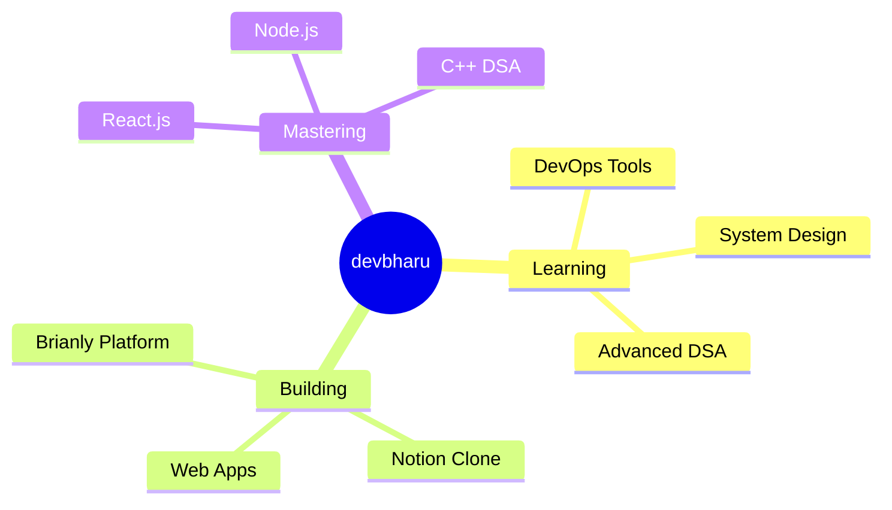

<div align="center">

# 👨‍💻 Hello, I'm Bharu! 


<p align="center">
  
  
  
</p>

</div>

---

## 🚀 About Me

```javascript
const devbharu = {
    location: "India 🇮🇳",
    pronouns: "He/Him",
    currentRole: "Computer Science Student @ SIT College",
    code: ["JavaScript", "Python", "C", "C++", "HTML", "CSS"],
    askMeAbout: ["Web Development", "DevOps", "DSA", "Full Stack Projects"],
    technologies: {
        frontEnd: {
            frameworks: ["React.js"],
            styling: ["Tailwind CSS", "CSS3"],
            core: ["HTML5", "JavaScript"]
        },
        backEnd: {
            runtime: ["Node.js"],
            frameworks: ["Express"],
            databases: ["MongoDB"]
        },
        languages: ["C", "C++", "Python", "JavaScript"],
        devOps: ["Docker", "Git", "GitHub Actions"],
        tools: ["VS Code", "Postman", "Git"]
    },
    currentFocus: "Building scalable web applications & mastering DevOps",
    learning: "DevOps Tools, System Design & Advanced DSA in C++",
    projects: ["Brianly (Educational Platform)", "Notion Clone", "Task Management Apps"],
    hobbies: ["Building Projects 💻", "Learning New Tech 🚀", "Problem Solving 🧩"]
};
```

<div align="center">

### 💡 *"First, solve the problem. Then, write the code."* – John Johnson

</div>

---

## 🛠️ Tech Stack & Tools

<div align="center">

### Frontend Development
<table>
<tr>
    <td align="center" width="90">
        
        <br>HTML5
    </td>
    <td align="center" width="90">
        
        <br>CSS3
    </td>
    <td align="center" width="90">
        
        <br>JavaScript
    </td>
    <td align="center" width="90">
        
        <br>React.js
    </td>
    <td align="center" width="90">
        
        <br>Tailwind
    </td>
</tr>
</table>

### Backend & Databases
<table>
<tr>
    <td align="center" width="90">
        
        <br>Node.js
    </td>
    <td align="center" width="90">
        
        <br>Express
    </td>
    <td align="center" width="90">
        
        <br>MongoDB
    </td>
    <td align="center" width="90">
        
        <br>Python
    </td>
</tr>
</table>

### Programming Languages & DSA
<table>
<tr>
    <td align="center" width="90">
        
        <br>C
    </td>
    <td align="center" width="90">
        
        <br>C++
    </td>
    <td align="center" width="90">
        
        <br>Python
    </td>
    <td align="center" width="90">
        
        <br>JavaScript
    </td>
</tr>
</table>

### DevOps & Tools
<table>
<tr>
    <td align="center" width="90">
        
        <br>Docker
    </td>
    <td align="center" width="90">
        
        <br>Git
    </td>
    <td align="center" width="90">
        
        <br>GitHub
    </td>
    <td align="center" width="90">
        
        <br>VS Code
    </td>
    <td align="center" width="90">
        
        <br>Postman
    </td>
</tr>
</table>

</div>

---

## 📊 GitHub Analytics

<div align="center">
  
  
</div>

<div align="center">
  
</div>

---

## 🏆 GitHub Achievements

<div align="center">
  


</div>

---

## 🎯 What I'm Up To

<div align="center">



</div>

<br>

- 🎓 **Computer Science Student** at **SIT College**
- 🔭 Currently working on **Full Stack Web Applications & DevOps Projects**
- 🌱 Learning **DevOps Tools, System Design & Advanced DSA in C++**
- 💻 Building projects like **Brianly** (Educational Platform), **Notion Clone**, and more
- 👯 Open to collaborate on **Web Development & Open Source Projects**
- 💬 Ask me about **React.js, Node.js, JavaScript, DSA in C++, DevOps**
- 📫 Reach me at **your.email@example.com** (update with your email!)
- ⚡ Fun fact: **I turn ☕ into code and bugs into features!**

---

## 🚀 Featured Projects

<div align="center">

### 🧠 Brianly - Educational Platform
> A comprehensive educational platform built with modern web technologies
> 
> **Tech Stack:** React.js, Node.js, Express, MongoDB, Tailwind CSS

---

### 📝 Notion Clone
> A feature-rich note-taking and productivity application
> 
> **Tech Stack:** React.js, Node.js, MongoDB

---

### ✅ Task Management Apps
> Multiple task management and todo applications with different features
> 
> **Tech Stack:** React.js, JavaScript, CSS

</div>

---

## 📌 Pinned Repositories

<div align="center">

<!-- Replace 'repo-name' with your actual repository names -->
<a href="https://github.com/devbharu/brianly">
  
</a>

<a href="https://github.com/devbharu/notion-clone">
  
</a>

</div>

<div align="center">

<a href="https://github.com/devbharu/dsa-cpp">
  
</a>

<a href="https://github.com/devbharu/task-manager">
  
</a>

</div>

---

## 📈 Contribution Activity

<div align="center">
  


</div>

---

## 🌐 Connect With Me

<div align="center">

[](https://linkedin.com/in/your-profile)
[](https://twitter.com/your-handle)
[](https://yourwebsite.com)
[](mailto:your.email@example.com)
[](https://instagram.com/your-handle)
[](https://discord.gg/your-server)

</div>

---

## 💭 Random Dev Quote

<div align="center">


</div>

---

## 🐍 Watch My Contributions

<div align="center">
  


</div>

---

<div align="center">

### 💙 Thanks for visiting my profile! Let's build something amazing together!


<br>

**⭐ If you like my work, consider giving a star to my repos! ⭐**

**🤝 Open to collaborations and learning opportunities! 🤝**

</div>
